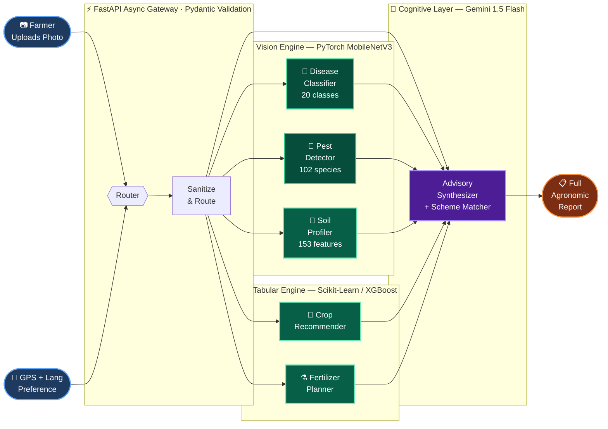

<div align="center">

<h3>🌾 · Diagnose · Predict · Advise · Protect · Empower · 🌾</h3>

<p>
  
  
  
  
  
</p>

<p>
  <a href="#-why-krishi-ai">Why</a> &nbsp;|&nbsp;
  <a href="#-how-it-works">How It Works</a> &nbsp;|&nbsp;
  <a href="#-ai-model-registry">AI Models</a> &nbsp;|&nbsp;
  <a href="#-platform-capabilities">Capabilities</a> &nbsp;|&nbsp;
  <a href="#-tech-stack">Stack</a> &nbsp;|&nbsp;
  <a href="#-quick-start">Quick Start</a> &nbsp;|&nbsp;
  <a href="#-api">API</a>
</p>

</div>


<br/>

<div align="center">

### Platform at a Glance

<table>
<tr>
  <td align="center" width="19%">
    <br/>
    <sub>🧬 Plant Pathology</sub><br/>
    <sub><i>MobileNetV3 · CNN</i></sub>
  </td>
  <td align="center" width="2%"><b>|</b></td>
  <td align="center" width="19%">
    <br/>
    <sub>🐛 Entomology</sub><br/>
    <sub><i>Deep Visual Net</i></sub>
  </td>
  <td align="center" width="2%"><b>|</b></td>
  <td align="center" width="19%">
    <br/>
    <sub>🧪 Soil Vision</sub><br/>
    <sub><i>OpenCV · RF</i></sub>
  </td>
  <td align="center" width="2%"><b>|</b></td>
  <td align="center" width="19%">
    <br/>
    <sub>⚡ API Speed</sub><br/>
    <sub><i>Async FastAPI</i></sub>
  </td>
  <td align="center" width="2%"><b>|</b></td>
  <td align="center" width="19%">
    <br/>
    <sub>🤖 Advisory LLM</sub><br/>
    <sub><i>Contextual · Local</i></sub>
  </td>
</tr>
</table>

</div>

<br/>

---

## 🔥 Why Krishi AI

<table>
<tr>
<td width="50%" valign="top">

#### The Crisis
> **40% of India's crop yield is lost annually** — not from drought or floods, but from diseases farmers cannot name, pests they cannot identify, and soil imbalances invisible to the naked eye.

Smallholder farmers — 86% of India's agricultural base — have no access to lab equipment, agronomists, or real-time market data. They make high-stakes decisions with incomplete information every single day.

</td>
<td width="50%" valign="top">

#### The Solution
Krishi AI puts a **full agronomic intelligence system** inside any smartphone. A single photo upload triggers a parallel AI pipeline that returns:

- ✅ Clinical-grade **disease + pest diagnosis**
- ✅ Soil chemistry analysis **without a lab**
- ✅ **Fertilizer dosage** calculated to the gram
- ✅ **Live market prices** to time the harvest
- ✅ **Government scheme** eligibility in seconds

</td>
</tr>
</table>

<br/>

---

## ⚙️ How It Works

> A single image traverses a **5-stage heterogeneous AI pipeline** — computer vision → tabular prediction → LLM reasoning — all orchestrated asynchronously by FastAPI in under 150ms.



<br/>

---

## 🧬 AI Model Registry

> Five purpose-built intelligence modules — each guarded by a **confidence circuit-breaker** that halts and re-prompts rather than returning an uncertain result.

<details>
<summary><b>&nbsp;🌿 Model 1 — Plant Pathology Classifier &nbsp;<code>PyTorch · MobileNetV3-Large</code></b></summary>

<br/>

| Property | Detail |
|:---|:---|
| **Framework** | PyTorch — MobileNetV3-Large |
| **Input** | Leaf image · 224 × 224 px · RGB |
| **Coverage** | 20 disease classes — Blight, Rust, Scab, Mosaic, and more |
| **Feature Extraction** | Spatial CNN convolutions → depthwise separable feature maps |
| **Confidence Gate** | `< 35%` confidence → auto re-scan prompt (never returns wrong diagnosis) |
| **Output** | Disease name · severity score · treatment protocol |

</details>

<details>
<summary><b>&nbsp;🐛 Model 2 — Entomology Identification Network &nbsp;<code>PyTorch · MobileNetV3 Deep</code></b></summary>

<br/>

| Property | Detail |
|:---|:---|
| **Framework** | PyTorch — MobileNetV3 (deeper variant) |
| **Input** | Pest image · 224 × 224 px · RGB |
| **Coverage** | 102 agricultural insect species → treatment database |
| **Feature Extraction** | Deep CNN visual pattern recognition → species taxonomy mapping |
| **Confidence Gate** | `< 20%` confidence → secondary verification triggered |
| **Output** | Species ID · organic remedy · chemical remedy |

</details>

<details>
<summary><b>&nbsp;🧪 Model 3 — Soil Texture Vision Profiler &nbsp;<code>Scikit-Learn · Random Forest + OpenCV</code></b></summary>

<br/>

| Property | Detail |
|:---|:---|
| **Framework** | Scikit-Learn — Random Forest Classifier |
| **Input** | Soil image · 256 × 256 px · RGB |
| **Coverage** | Sandy / Loamy / Clay / Silt texture classification |
| **Feature Engineering** | **153 handcrafted features** = 96 HSV histogram bins + 48 LAB color moments + 6 RGB statistics + 3 Sobel gradient magnitudes |
| **Confidence Gate** | `< 40%` confidence → rejects non-soil artifacts entirely |
| **Output** | Soil texture class · NPK suitability · water retention profile |

</details>

<details>
<summary><b>&nbsp;🌾 Model 4 — Crop & Fertilizer Predictor &nbsp;<code>Scikit-Learn · Random Forest + XGBoost</code></b></summary>

<br/>

| Property | Detail |
|:---|:---|
| **Framework** | Scikit-Learn Random Forest + XGBoost ensemble |
| **Input** | NPK values · soil pH · temperature · humidity |
| **Coverage** | Multi-crop recommendation matrix with NPK deficit calculation |
| **Feature Extraction** | Multi-variable decision trees on soil chemistry + microclimate vectors |
| **Guardrails** | Hard agronomical boundary checks — no biologically impossible outputs |
| **Output** | Top 3 crops · kg/acre fertilizer dosage · application timeline |

</details>

<details>
<summary><b>&nbsp;🤖 Model 5 — Generative Advisory Synthesizer &nbsp;<code>Google Gemini-1.5-Flash LLM</code></b></summary>

<br/>

| Property | Detail |
|:---|:---|
| **Framework** | Google Gemini 1.5 Flash — via Google Generative AI SDK |
| **Input** | Structured JSON (vision results + tabular predictions + weather + market data) |
| **Coverage** | Localized treatment plans · Mandi price analysis · Govt. scheme eligibility |
| **Safety** | Strict Pydantic JSON schema enforcement + XSS sanitization on all output streams |
| **Multilingual** | gTTS converts advisory text to regional-language voice audio |
| **Output** | Complete agronomic action plan · scheme links · market timing advice |

</details>

<br/>

---

## 🚀 Platform Capabilities

<table width="100%">
<tr>
<td width="50%" valign="top">

### 🔬 Field Diagnostics
Real-time visual AI for every crop problem.

- **Crop Pathology** — 20-class disease detection in < 150ms
- **Pest Identification** — 102-species entomology with remedy lookup
- **Soil Profiling** — Lab-quality texture analysis from a photo
- **Severity Scoring** — Urgency grading triggers priority alerts

</td>
<td width="50%" valign="top">

### 💧 Precision Advisory
Data-driven recommendations, not guesswork.

- **NPK Calculator** — Nitrogen/Phosphorus/Potassium shortfall in kg/acre
- **Irrigation Planner** — Evapotranspiration-based daily water scheduling
- **Yield Optimizer** — Top cash crop alternatives by soil-microclimate fit
- **Voice Output** — Regional-language TTS for zero-literacy accessibility

</td>
</tr>
<tr>
<td width="50%" valign="top">

### 📈 Market Intelligence
Know your price before you harvest.

- **Live Mandi Tracker** — Real-time commodity rates from Mandi feeds
- **7-Day Price Trends** — Chart.js visualization of market momentum
- **Arbitrage Analyzer** — Rural vs. city-centre price comparison
- **Harvest Timing** — Peak demand prediction for premium pricing

</td>
<td width="50%" valign="top">

### 📜 Government Schemes
Every subsidy you qualify for, instantly surfaced.

- **Eligibility Engine** — PM-KISAN · PMFBY · KUSUM · regional schemes
- **Portal Deep-Links** — Direct navigation to official application portals
- **Resource Library** — Best practices · disaster recovery · crop calendars

</td>
</tr>
</table>

<br/>

---

## 🛠️ Tech Stack

<div align="center">

| Layer | Technology | Role |
|:---:|:---:|:---|
| **Backend** |    | Async REST gateway · ASGI server · payload validation |
| **Vision AI** |   | MobileNetV3 CNNs · 153-feature soil extraction |
| **Tabular AI** |   | Crop recommendation · NPK deficit calculation |
| **Generative AI** |   | Advisory synthesis · regional voice output |
| **Frontend** |    | Glassmorphic dashboard · live charts · animations |
| **External APIs** |   | Live weather telemetry · Mandi commodity pricing |

</div>

<br/>

---

## 📂 Project Layout

```
Krishi-Ai-main/
│
├── backend/
│   ├── app/
│   │   ├── routers/
│   │   │   ├── detection.py        →  POST /detect/disease · /pest · /soil
│   │   │   ├── prediction.py       →  POST /predict/crop · /fertilizer
│   │   │   ├── advisory.py         →  POST /advisory/generate
│   │   │   ├── market.py           →  GET  /market/prices
│   │   │   └── schemes.py          →  POST /schemes/match
│   │   ├── services/
│   │   │   ├── disease_service.py  →  MobileNetV3 pathology inference
│   │   │   ├── pest_service.py     →  Entomology detection pipeline
│   │   │   ├── soil_service.py     →  153-feature OpenCV + RF classifier
│   │   │   ├── crop_service.py     →  XGBoost crop recommender
│   │   │   └── gemini_service.py   →  Gemini 1.5 Flash advisory engine
│   │   └── config.py               →  Thresholds · API keys · settings
│   ├── model_store/                →  .h5 / .pkl trained model artifacts
│   └── run.py                      →  Uvicorn server entry point
│
├── frontend/
│   ├── assets/                     →  Glassmorphism CSS · i18n.js · kisaan.js
│   ├── components/                 →  Navbar · Footer · Loader · Modals
│   ├── vendor/                     →  Chart.js · AOS.js · SweetAlert2
│   ├── index.html                  →  Landing page
│   ├── detection.html              →  Vision scanner interface
│   ├── prediction.html             →  NPK + crop calculator
│   ├── advisory.html               →  AI advisory dashboard
│   ├── market.html                 →  Mandi price analytics
│   └── schemes.html                →  Government scheme matcher
│
├── scripts/                        →  expand_pest_advisory.py
├── requirements.txt
└── README.md
```

<br/>

---

## ⚡ Quick Start

> **Prerequisites:** Python 3.9+ · Git · 4 GB RAM

<br/>

**Step 1 — Clone**
```bash
git clone https://github.com/jeswanth90630/Krishi-Ai.git && cd Krishi-Ai-main
```

**Step 2 — Virtual Environment**
```bash
python -m venv .venv

# Windows PowerShell
.\.venv\Scripts\activate

# macOS / Linux
source .venv/bin/activate
```

**Step 3 — Install**
```bash
pip install -r requirements.txt

# CPU-only PyTorch (lighter build)
pip install torch torchvision --index-url https://download.pytorch.org/whl/cpu
```

**Step 4 — Run**
```bash
# Windows
$env:PYTHONPATH="backend"; python backend/run.py

# macOS / Linux
PYTHONPATH=backend python backend/run.py
```

> 🚀 **Live at:** `http://127.0.0.1:8000`
> 📖 **Swagger UI:** `http://127.0.0.1:8000/docs`
> 📄 **ReDoc:** `http://127.0.0.1:8000/redoc`

<br/>

---

## 📡 API Reference

### 🔬 Detection — `multipart/form-data` image upload

| Method | Route | Model | Response |
|:---:|:---|:---:|:---|
| `POST` | `/api/v1/detect/disease` | MobileNetV3 | Class · confidence · treatment steps |
| `POST` | `/api/v1/detect/pest` | MobileNetV3 | Species · organic remedy · chemical remedy |
| `POST` | `/api/v1/detect/soil` | Random Forest | Texture · 153-feature profile · NPK suitability |

### 📊 Prediction — `application/json` structured payload

| Method | Route | Input | Response |
|:---:|:---|:---:|:---|
| `POST` | `/api/v1/predict/crop` | NPK · pH · Temp · RH | Top 3 crops + yield estimates |
| `POST` | `/api/v1/predict/fertilizer` | NPK deficit · area | Dosage in kg/acre + application calendar |

### 🌐 Intelligence — live data feeds + LLM

| Method | Route | Response |
|:---:|:---|:---|
| `GET` | `/api/v1/market/prices` | Real-time Mandi rates + 7-day trend forecast |
| `POST` | `/api/v1/schemes/match` | Eligible schemes + official portal deep-links |

<br/>

---

## 🛡️ Safety & Privacy

| Guardrail | Mechanism |
|:---|:---|
| 🔒 **Ephemeral Image Processing** | All uploads processed in RAM only — never written to disk |
| ⚠️ **Confidence Circuit-Breakers** | Models below 20–40% threshold halt and prompt re-scan |
| 🧪 **Schema Validation** | All Gemini outputs validated through strict Pydantic schemas |
| 🧹 **XSS Sanitization** | Every text advisory string scrubbed before client delivery |

> [!WARNING]
> Krishi AI outputs are **agronomic decision-support tools**. High-severity crop disease alerts should always be cross-referenced with a certified field agronomist before applying chemical treatments.

<br/>


