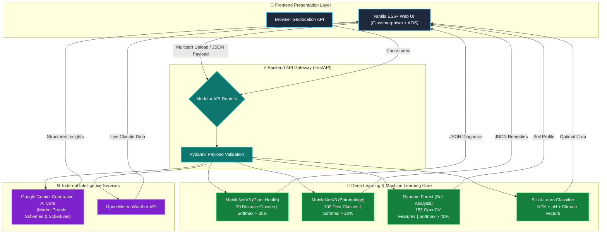

<div align="center">

<!-- HEADER ANIMATION -->
<a href="https://git.io/typing-svg">
  
</a>

# 🌾 KRISHI AI

### *Empowering Agriculture through Deep Learning & Generative AI*

<p align="center">
  <b>A next-generation, high-performance agricultural decision system combining Convolutional Neural Networks, Classical Machine Learning, and Large Language Models.</b>
</p>

<!-- BADGES & SHIELDS -->
<p align="center">
  <a href="#-key-features"></a>
  <a href="#-tech-stack"></a>
  <a href="#-tech-stack"></a>
  <a href="#-tech-stack"></a>
  <a href="#-tech-stack"></a>
  <a href="LICENSE"></a>
</p>

<!-- QUICK LINKS BAR -->
<p align="center">
  <a href="#-platform-architecture"><b>Architecture</b></a> •
  <a href="#-the-5-ai-intelligence-pillars"><b>AI Models</b></a> •
  <a href="#-key-features"><b>Features</b></a> •
  <a href="#-tech-stack"><b>Tech Stack</b></a> •
  <a href="#-quick-start"><b>Quick Start</b></a> •
  <a href="#-api-documentation"><b>API Docs</b></a>
</p>


</div>

---

## 🌟 Executive Summary

**Krishi AI** is a multi-modal, end-to-end agricultural intelligence platform engineered to eliminate yield loss, misdiagnosis, and market opacity for modern farming operations. 

By unifying lightweight mobile-edge **Convolutional Neural Networks (MobileNetV3)**, texture-analyzing **Scikit-Learn Classifiers**, and context-aware **Google Gemini Generative AI**, Krishi AI converts raw field telemetry and leaf imagery into real-time, high-precision agronomical advisories.

---

## 🏛️ System Architecture

The ecosystem relies on an asynchronous event-driven backend built on **FastAPI**, serving zero-latency static assets alongside AI inference engines.



---

## 🧠 The 5 AI Intelligence Pillars

Krishi AI replaces single-model limitations with a **Hybrid Machine Learning Architecture**, deploying specialized models optimized for specific visual, tabular, and conversational domains.

| Pillar | Model / Algorithm | Input Data | Target Domain & Feature Extraction | Safety / Precision Net |
| :--- | :--- | :--- | :--- | :--- |
| **1. Plant Disease Scan** | **MobileNetV3-Large** *(PyTorch)* | Leaf Imagery (`224x224`) | CNN Spatial Feature Map trained on PlantVillage (20 classes like Late Blight, Apple Scab) | Confidence Threshold `< 35%` triggers rejection guardrail |
| **2. Pest Identification** | **MobileNetV3-Large** *(PyTorch)* | Pest Imagery (`224x224`) | Entomology Neural Net classifying **102 agricultural insect species** mapped to `pest_db.json` | Confidence Threshold `< 20%` triggers rejection guardrail |
| **3. Soil Texture Analyzer** | **Random Forest** *(Scikit-Learn)* | Soil Imagery (`256x256`) | Manual OpenCV extraction of **153 mathematical features** (96 HSV + 48 LAB + 6 RGB + 3 Sobel Gradients) | Confidence Threshold `< 40%` triggers non-soil rejection |
| **4. Crop Recommendation** | **Random Forest / ML** *(Scikit-Learn)* | Tabular NPK, pH & Weather | Vectorized matching of Nitrogen, Phosphorus, Potassium, Humidity, and Rainfall against optimal soil conditions | Deterministic Agronomical Bounds |
| **5. Generative Reasoning** | **Google Gemini LLM** | Structured JSON Prompts | Dynamic calculation of price elasticity, Mandi price trends, PM-KISAN eligibility, and daily farm tasks | Strict JSON schema enforcement & markdown sanitization |

---

## 🚀 Key Modules & Capabilities

<table>
  <tr>
    <td width="50%" valign="top">
      <h3>🔍 Multi-Modal Field Health Scan</h3>
      <ul>
        <li><b>Instant Plant Pathology:</b> Identifies 20 fungal, bacterial, and viral crop diseases.</li>
        <li><b>Pest Detection Engine:</b> Pinpoints 102 insect species with exact chemical & organic remedies.</li>
        <li><b>Vision Soil Profiling:</b> Measures soil texture, porosity, and organic suitability without physical lab kits.</li>
      </ul>
    </td>
    <td width="50%" valign="top">
      <h3>🌱 Smart Crop & Fertilizer Advisor</h3>
      <ul>
        <li><b>NPK Deficit Calculation:</b> Calculates exact kilogram shortfall per acre and provides customized fertilization timelines.</li>
        <li><b>Precision Water Planner:</b> Computes evapotranspiration-based daily irrigation needs.</li>
        <li><b>Yield Maximizer:</b> Recommends cash crops tailored to real-time micro-climate data.</li>
      </ul>
    </td>
  </tr>
  <tr>
    <td width="50%" valign="top">
      <h3>📈 Mandi Market Intelligence</h3>
      <ul>
        <li><b>Dynamic Pricing Forecasts:</b> AI-driven price charts powered by Chart.js.</li>
        <li><b>Arbitrage Analyzer:</b> Compares local rural Mandis vs. city centers to evaluate transport profitability.</li>
        <li><b>Demand Sentiment:</b> Predicts market surges to advise farmers on ideal harvest-sale timing.</li>
      </ul>
    </td>
    <td width="50%" valign="top">
      <h3>📜 Govt. Scheme & Welfare Matcher</h3>
      <ul>
        <li><b>AI Eligibility Engine:</b> Evaluates farmer demographics against state/national schemes (PM-KISAN, PMFBY, KUSUM).</li>
        <li><b>Direct Portal Bridge:</b> Connects verified eligible farmers directly to official government application portals.</li>
        <li><b>Zero-Fund Waste:</b> Ensures financial subsidies reach eligible smallholder farmers.</li>
      </ul>
    </td>
  </tr>
</table>

---

## 🛠️ Technology Stack

<table align="center">
  <tr>
    <td align="center" width="20%"><b>Core AI & ML</b></td>
    <td>
      
      
      
      
      
      
    </td>
  </tr>
  <tr>
    <td align="center" width="20%"><b>Backend Infrastructure</b></td>
    <td>
      
      
      
      
    </td>
  </tr>
  <tr>
    <td align="center" width="20%"><b>Frontend & Visuals</b></td>
    <td>
      
      
      
      
      
    </td>
  </tr>
  <tr>
    <td align="center" width="20%"><b>External Services</b></td>
    <td>
      
      
    </td>
  </tr>
</table>

---

## 📂 Project Architecture

```text
krishi-ai/
├── backend/backend/                # Core FastAPI Microservices
│   ├── app/                        # Application Domain Modules
│   │   ├── routers/                # Endpoints (detection, prediction, advisory, market)
│   │   ├── services/               # Inference Pipelines & Gemini API Integration
│   │   └── config.py               # Application Settings & Guardrails
│   └── run.py                      # Server Entry Point & Static File Server
├── frontend/                       # Client UI Application
│   ├── assets/                     # Stylesheets (CSS variables, Glassmorphic UI), Scripts
│   ├── components/                 # Shared UI Components & Navbars
│   └── pages/                      # Application Interfaces (index.html, scan.html, etc.)
├── models/exports/                 # Production AI Artifacts (.pth, .pkl, metadata)
├── data/                           # Training & Validation Datasets
└── requirements.txt                # Production Dependencies
```

---

## ⚙️ Quick Start & Installation

### 1. Repository Setup & Environment

```bash
# Clone the repository
git clone https://github.com/vigneshaadepu/Krishi-Ai.git
cd Krishi-Ai

# Create and activate Python virtual environment
python -m venv .venv
# On Windows PowerShell:
.\.venv\Scripts\activate
# On Linux/macOS:
source .venv/bin/activate
```

### 2. Dependency Installation

```bash
# Install core dependencies
pip install -r requirements.txt

# Install PyTorch engine (CPU optimized or CUDA enabled)
pip install torch torchvision --index-url https://download.pytorch.org/whl/cpu
```

### 3. Launching the Platform

```powershell
# Set backend execution path (Windows PowerShell)
$env:PYTHONPATH="backend/backend"

# Start unified server
python backend/backend/run.py
```

The system will initialize at: **`http://127.0.0.1:8000`**

---

## 📋 Interactive API Documentation

Once the backend service is running, interact with live endpoint specs:

- **Swagger UI**: [`http://127.0.0.1:8000/docs`](http://127.0.0.1:8000/docs)
- **ReDoc Interface**: [`http://127.0.0.1:8000/redoc`](http://127.0.0.1:8000/redoc)

---

## 🔒 Privacy & Operational Safety

1. **Zero Data Retention:** Image uploads during Field Health Scans are processed entirely in RAM/VRAM during inference and purged immediately.
2. **Confidence Safety Net:** Any input falling below minimum statistical confidence thresholds is gracefully rejected to protect farmers from misdiagnosis.
3. **Structured AI Guardrails:** Generative AI responses pass through strict JSON schema validation to guarantee deterministic API outputs.

---

<div align="center">


### 🌾 Krishi AI — *Architecting the Future of Smart Agriculture*

<p align="center">
  Designed & Built with ❤️ for Global Farming Communities
</p>

<p align="center">
  <a href="#"><b>⬆ Back to Top</b></a>
</p>

</div>
