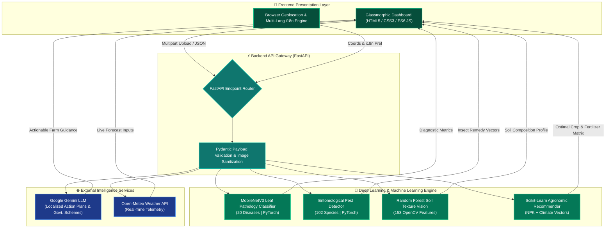

<div align="center">

  <!-- DYNAMIC TYPING HEADER SVG -->
  <a href="https://github.com/jeswanth90630/Krishi-ai">
    
  </a>

  <br/>
  <br/>

  <h1>🌾 KRISHI AI</h1>
  <h3>Next-Generation Multimodal Precision Agriculture & Agronomic Decision System</h3>
  <p><i>Unifying Edge Computer Vision, Classical Agronomic Machine Learning & LLM Reasoning to Protect Crop Yields</i></p>

  <br/>

  <!-- BADGES MATRIX (Cohesive Green/Teal Palette) -->
  <p align="center">
    <a href="https://github.com/jeswanth90630/Krishi-ai">
      
    </a>
    <a href="https://python.org">
      
    </a>
    <a href="https://fastapi.tiangolo.com/">
      
    </a>
    <a href="https://pytorch.org/">
      
    </a>
    <a href="https://scikit-learn.org/">
      
    </a>
    <a href="https://ai.google.dev/">
      
    </a>
    <a href="https://opensource.org/licenses/MIT">
      
    </a>
  </p>

  <br/>

  <!-- METRICS HIGHLIGHT BOARD -->
  <table align="center" width="100%">
    <tr>
      <td align="center" valign="top" width="20%">
        <h3>🧬 20+</h3>
        <p><b>Leaf Diseases</b><br/><sub>PyTorch MobileNetV3</sub></p>
      </td>
      <td align="center" valign="top" width="20%">
        <h3>🐛 102</h3>
        <p><b>Pest Species</b><br/><sub>Deep Entomological Vision</sub></p>
      </td>
      <td align="center" valign="top" width="20%">
        <h3>🧪 153</h3>
        <p><b>Soil Features</b><br/><sub>OpenCV Gradients & Color</sub></p>
      </td>
      <td align="center" valign="top" width="20%">
        <h3>⚡ &lt;150ms</h3>
        <p><b>Inference Speed</b><br/><sub>Asynchronous FastAPI API</sub></p>
      </td>
      <td align="center" valign="top" width="20%">
        <h3>🤖 Gemini</h3>
        <p><b>Gen-AI Advisor</b><br/><sub>Contextual Local Guidance</sub></p>
      </td>
    </tr>
  </table>

  <br/>

  <!-- QUICK NAVIGATION CHIPS -->
  <p align="center">
    <a href="#-executive-overview"><b>Overview</b></a> &nbsp;•&nbsp;
    <a href="#-system-architecture"><b>Architecture</b></a> &nbsp;•&nbsp;
    <a href="#-ai--ml-model-pipeline"><b>AI Models</b></a> &nbsp;•&nbsp;
    <a href="#-core-capabilities"><b>Core Capabilities</b></a> &nbsp;•&nbsp;
    <a href="#-technology-ecosystem"><b>Tech Stack</b></a> &nbsp;•&nbsp;
    <a href="#-project-structure"><b>Project Structure</b></a> &nbsp;•&nbsp;
    <a href="#-installation--setup"><b>Getting Started</b></a> &nbsp;•&nbsp;
    <a href="#-api-endpoint-reference"><b>API Docs</b></a>
  </p>

</div>

---

## 📌 Executive Overview

**Krishi AI** is an enterprise-grade, multi-modal agronomic intelligence platform designed to eliminate crop yield loss, diagnose plant diseases in real time, and eliminate market opacity for agricultural communities.

By orchestrating **Convolutional Neural Networks (MobileNetV3 / ResNet)** for visual field scans, **Scikit-Learn Ensemble Models** for soil texture and crop-fertilizer recommendations, and **Google Gemini Generative AI** for localized advisory generation, Krishi AI converts a simple smartphone photo into a full agronomical diagnostic report.

> [!TIP]
> ### 💡 30-Second Recruiter & Technical Summary
> - **The Problem:** Smallholder farmers lose up to **40% of crop yields** due to undetected leaf diseases, pest infestations, and unoptimized soil fertilization.
> - **The Architecture:** Asynchronous **FastAPI REST Gateway** running PyTorch neural nets, Scikit-Learn tabular predictors, and LLM reasoning engines with zero-latency response pipelines.
> - **Key Highlights:** Instant visual pathology diagnosis, automated NPK fertilizer deficit calculation, weather-aware irrigation scheduling, live Mandi commodity tracking, and multi-lingual voice output.

---

## 🏛️ System Architecture

Krishi AI utilizes an asynchronous, event-driven microservice architecture powered by **FastAPI**, with strict Pydantic payload validation, RAM/VRAM inference pipelines, and automated fallback guardrails.



---

## 🧠 AI & ML Model Pipeline

Krishi AI replaces single-model architectures with a **Hybrid Machine Learning Pipeline**, deploying specialized models fine-tuned for visual, tabular, and conversational domains.

### 🧬 Model Cards

#### 1️⃣ Plant Pathology Scan
> **Framework:** PyTorch — `MobileNetV3-Large`
> - **Input Vector:** Leaf Image (`224x224 RGB`)
> - **Domain & Feature Extraction:** Spatial CNN feature mapping across **20 disease classes** (Blight, Rust, Scab, Mosaic)
> - **Guardrails & Safety Net:** Confidence threshold `< 35%` triggers automated re-scan prompt to prevent erroneous recommendations

#### 2️⃣ Entomology Identification
> **Framework:** PyTorch — `MobileNetV3 Deep Classifier`
> - **Input Vector:** Pest Image (`224x224 RGB`)
> - **Domain & Feature Extraction:** Deep visual classification across **102 agricultural insect species** mapped to treatment database
> - **Guardrails & Safety Net:** Confidence threshold `< 20%` triggers secondary verification

#### 3️⃣ Soil Texture Vision
> **Framework:** Scikit-Learn — `Random Forest Classifier`
> - **Input Vector:** Soil Photo (`256x256 RGB`)
> - **Domain & Feature Extraction:** Manual extraction of **153 mathematical features** (96 HSV + 48 LAB + 6 RGB + 3 Sobel Gradients)
> - **Guardrails & Safety Net:** Confidence threshold `< 40%` rejects non-soil artifacts and prompts user re-scan

#### 4️⃣ Crop & Fertilizer Predictor
> **Framework:** Scikit-Learn — `Random Forest & XGBoost`
> - **Input Vector:** NPK Ratio, soil pH, Temperature, Humidity
> - **Domain & Feature Extraction:** Multi-variable decision trees matching soil chemistry with optimal crop yield profiles
> - **Guardrails & Safety Net:** Hard agronomical deterministic boundary checks to ensure recommendation validity

#### 5️⃣ Generative Reasoning
> **Framework:** Google Gemini — `Gemini-1.5-Flash LLM`
> - **Input Vector:** Structured JSON Context (Visual Diagnostics + Tabular Chemistry + Weather + Market Trends)
> - **Domain & Feature Extraction:** Generates localized agronomic treatment steps, Mandi price trends, and Govt. scheme eligibility
> - **Guardrails & Safety Net:** Strict JSON schema enforcement & XSS sanitization of text advisory streams

---

## 🚀 Core Capabilities

<table width="100%">
  <tr>
    <td width="50%" valign="top">
      <h3>🔬 Multi-Modal Field Diagnostics</h3>
      <ul>
        <li><b>🌱 Instant Crop Pathology:</b> Identifies fungal, bacterial, and viral crop infections within milliseconds.</li>
        <li><b>🐛 Entomology Engine:</b> Pinpoints insect species with organic & chemical remedy options.</li>
        <li><b>🧪 Soil Vision Profiler:</b> Estimates soil texture, porosity, and organic suitability visually.</li>
        <li><b>📊 Severity Grading:</b> Evaluates infection severity to determine urgent vs. standard interventions.</li>
      </ul>
    </td>
    <td width="50%" valign="top">
      <h3>🌾 Precision Crop & Water Advisory</h3>
      <ul>
        <li><b>⚖️ NPK Deficit Calculator:</b> Measures nitrogen, phosphorus, and potassium shortfall per acre with dosage schedules.</li>
        <li><b>💧 Smart Irrigation Engine:</b> Calculates evapotranspiration-based daily watering recommendations.</li>
        <li><b>📈 Yield Maximizer:</b> Recommends high-value alternative cash crops based on soil microclimate.</li>
        <li><b>🔊 Voice-Assisted Insights:</b> Built-in TTS support for regional language accessibility.</li>
      </ul>
    </td>
  </tr>
  <tr>
    <td width="50%" valign="top">
      <h3>📈 Mandi Market Intelligence</h3>
      <ul>
        <li><b>📊 Live Commodity Tracker:</b> Tracks real-time price fluctuations across regional agricultural markets (Mandis).</li>
        <li><b>📉 Interactive Trend Analytics:</b> Visualized price forecasting powered by Chart.js.</li>
        <li><b>🚚 Arbitrage Analyzer:</b> Compares local rural Mandis vs. city centers to evaluate net transport profit margins.</li>
        <li><b>📅 Harvest Timing Guidance:</b> Predicts market demand surges to advise on optimal harvest dates.</li>
      </ul>
    </td>
    <td width="50%" valign="top">
      <h3>📜 Welfare & Subsidy Matcher</h3>
      <ul>
        <li><b>🎯 Automated Eligibility Engine:</b> Evaluates landholding and crop profiles against PM-KISAN, PMFBY, KUSUM, and regional schemes.</li>
        <li><b>🔗 Direct Portal Integration:</b> Provides direct links to official state and national application portals.</li>
        <li><b>📚 Resource Knowledge Base:</b> Comprehensive repository of agronomical best practices and disaster recovery guides.</li>
      </ul>
    </td>
  </tr>
</table>

---

## 🛠️ Technology Ecosystem

### ⚡ Core Backend
* **FastAPI**  - Asynchronous REST API serving and request routing.
* **Uvicorn**  - High-performance ASGI web server wrapper.
* **Pydantic**  - Asynchronous payload validation and schema safety.

### 🧠 Neural Vision & Machine Learning
* **PyTorch**  - MobileNetV3 Convolutional Neural Network execution.
* **Scikit-Learn**  - Tabular machine learning & classifier matrices.
* **OpenCV**  - Custom soil vision image feature calculations.

### 🤖 Generative Cognition & Speech
* **Google Gemini API**  - Dynamic local-first agronomist advice engine.
* **gTTS**  - Text-to-Speech voice translation for regional farmers.

### 💻 Client Interface
* **HTML5 / CSS3 Glassmorphism**   - Interactive, beautiful responsive web dashboards.
* **ES6 JS / Chart.js**   - Client state scripting & mandi commodity visual statistics.

### 🌐 Live External APIs
* **Open-Meteo API**  - Evapotranspiration and live climate weather data feeds.
* **AgMarket Feeds**  - Real-time mandi rates from local agricultural yards.

---

## 📂 Project Structure

```text
Krishi-Ai-main/
│
├── ⚡ backend/
│   ├── app/
│   │   ├── routers/            # FastAPI Endpoint Handlers (detection, prediction, advisory, market, schemes)
│   │   ├── services/           # ML Inference Engines & Gemini API Integration
│   │   └── config.py           # Application Settings & Confidence Threshold Guardrails
│   ├── model_store/            # Trained Weights (.h5, .pkl AI Artifacts)
│   └── run.py                  # Server Entrypoint (FastAPI + Uvicorn Async Launcher)
│
├── 💻 frontend/
│   ├── assets/                 # Custom Glassmorphism CSS, JS Drivers (i18n.js, kisaan.js)
│   ├── components/             # Dynamic UI Components (Navbar, Footer, Loader, Modals)
│   ├── vendor/                 # Vendor Assets (Chart.js, AOS.js, SweetAlert2)
│   ├── detection.html          # Plant Disease, Pest & Soil Vision Scanner
│   ├── prediction.html         # Crop Selection & NPK Fertilizer Deficit Calculator
│   ├── advisory.html           # Real-Time Agronomic Action Plan Dashboard
│   ├── market.html             # Mandi Commodity Price Chart Analytics
│   ├── schemes.html            # Government Welfare Subsidy Matcher
│   └── index.html              # Core Landing Page Gateway
│
├── 🛠️ scripts/                 # Utility Scripts (expand_pest_advisory.py)
├── 📦 requirements.txt         # Production Dependencies
└── 📄 README.md                # Platform Documentation
```

---

## ⚡ Installation & Setup

> [!NOTE]
> Ensure you have **Python 3.9+** and **Git** installed on your system before proceeding.

### Setup Wizard

```bash
# 1. Clone the repository and navigate into the workspace
git clone https://github.com/jeswanth90630/Krishi-Ai.git
cd Krishi-Ai-main

# 2. Build the Python virtual sandbox environment
python -m venv .venv

# 3. Activate the environment (Platform Specific)
# For Windows (PowerShell):
.\.venv\Scripts\activate
# For Linux / macOS:
source .venv/bin/activate

# 4. Install standard production requirements
pip install -r requirements.txt

# 5. Install CPU-optimized neural processing engines
pip install torch torchvision --index-url https://download.pytorch.org/whl/cpu

# 6. Set project execution variable & Launch application gateway
# Windows (PowerShell):
$env:PYTHONPATH="backend"
python backend/run.py
# Linux / macOS:
PYTHONPATH=backend python backend/run.py
```

> [!SUCCESS]
> The server will start running locally at **`http://127.0.0.1:8000`** 🚀

---

## 📡 API Endpoint Reference

Once the server is running, explore interactive API documentation directly in your browser:

* 📑 **Interactive Swagger UI:** [`http://127.0.0.1:8000/docs`](http://127.0.0.1:8000/docs)
* 📖 **ReDoc OpenAPI Documentation:** [`http://127.0.0.1:8000/redoc`](http://127.0.0.1:8000/redoc)

### Core Endpoints

* `POST /api/v1/detect/disease` - **Plant Pathology Scan**
  * *Payload / Format:* `multipart/form-data`
  * *Role:* Processes leaf image through MobileNetV3; returns pathology diagnosis & confidence.

* `POST /api/v1/detect/pest` - **Entomology Identification**
  * *Payload / Format:* `multipart/form-data`
  * *Role:* Identifies pest species; returns organic & chemical treatment options.

* `POST /api/v1/detect/soil` - **Soil Texture Vision**
  * *Payload / Format:* `multipart/form-data`
  * *Role:* Extracts 153 OpenCV visual features; predicts soil texture composition.

* `POST /api/v1/predict/crop` - **Crop Selection Predictor**
  * *Payload / Format:* `application/json`
  * *Role:* Analyzes NPK, pH, and microclimate vectors to recommend top 3 optimal crops.

* `POST /api/v1/predict/fertilizer` - **NPK Fertilizer Deficit Calculator**
  * *Payload / Format:* `application/json`
  * *Role:* Calculates NPK shortfall (kg/acre) and outputs custom dosage timeline.

* `GET /api/v1/market/prices` - **Mandi Market Rates**
  * *Payload / Format:* `Query Parameters`
  * *Role:* Returns real-time Mandi market rates and 7-day price trend forecasts.

* `POST /api/v1/schemes/match` - **Welfare & Subsidy Matcher**
  * *Payload / Format:* `application/json`
  * *Role:* Matches landholding profile with government agricultural welfare subsidies.

---

## 🛡️ Operational Safety & Privacy Guardrails

> [!IMPORTANT]
> * **🔒 Ephemeral Processing:** All images uploaded during visual scans are processed strictly in RAM and discarded immediately after inference.
> * **🛡️ Low-Confidence Rejection:** Diagnostic predictions falling below statistical threshold boundaries (e.g., `<35%`) prompt automatic user re-scans to prevent erroneous agricultural treatments.
> * **⚡ Strict Schema Validation:** Generative AI responses pass through deterministic Pydantic validation schemas to safeguard against hallucinated outputs.

---

<div align="center">

  <br/>

  <h3>🌾 Krishi AI — <i>Architecting the Future of Precision Agriculture</i></h3>
  <p><b>Engineered with 💚 for Farming Ecosystems Worldwide</b></p>

  <br/>

  <a href="#-krishi-ai">
    
  </a>

  <br/>
  <br/>

</div>
