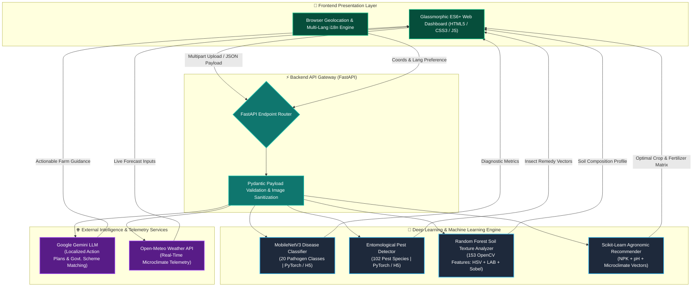

<div align="center">

<!-- HERO TYPING SVG BANNER -->
<a href="https://git.io/typing-svg">
  
</a>

<br/>

<h1>🌱 KRISHI AI</h1>
<h3><em>Next-Generation Precision Agriculture & Multimodal Farm Advisory Platform</em></h3>

<p align="center">
  <b>Bridging the gap between edge computer vision, classical agronomic ML, and generative AI reasoning to protect crop yields and empower smallholder farming ecosystems.</b>
</p>

<br/>

<!-- BADGES -->
<p align="center">
  
  
  
  
  
  
  
</p>

<br/>

<!-- QUICK NAVIGATION -->
<p align="center">
  <a href="#-executive-overview"><b>Overview</b></a> •
  <a href="#-system-architecture"><b>Architecture</b></a> •
  <a href="#-ai--ml-model-matrix"><b>AI Models</b></a> •
  <a href="#-core-modules"><b>Key Modules</b></a> •
  <a href="#-technology-stack"><b>Tech Stack</b></a> •
  <a href="#-project-structure"><b>Structure</b></a> •
  <a href="#-installation--setup"><b>Getting Started</b></a> •
  <a href="#-api-documentation"><b>API Reference</b></a>
</p>

<br/>

---

</div>

## 📌 Executive Overview

**Krishi AI** is an enterprise-grade, multi-modal agronomic intelligence platform designed to eliminate crop yield loss, diagnose plant diseases in real time, and eliminate market opacity for agricultural communities.

By orchestrating **Convolutional Neural Networks (MobileNetV3 / ResNet)** for visual field scans, **Scikit-Learn Ensemble Models** for soil texture and crop-fertilizer recommendations, and **Google Gemini Generative AI** for localized advisory generation, Krishi AI converts a simple smartphone photo into a full agronomical diagnostic report.

> **💡 Recruiter Summary (30-Second Snapshot):**
> - **Problem:** Smallholder farmers lack real-time access to agronomists, leading to up to 40% crop loss from undetected diseases and pests.
> - **Solution:** A unified FastAPI microservice suite running PyTorch vision models, Scikit-Learn tabular predictors, and LLM reasoning engines with zero-latency response pipelines.
> - **Impact:** Instant visual disease detection, automated fertilizer deficit calculation, weather-aware irrigation scheduling, and real-time Mandi price forecasting.

---

## 🏛️ System Architecture

Krishi AI utilizes an asynchronous, event-driven microservice architecture powered by **FastAPI**, with strict Pydantic payload validation, RAM/VRAM inference pipelines, and automated fallback guardrails.



---

## 🧠 AI & ML Model Matrix

Krishi AI replaces single-model architectures with a **Hybrid Machine Learning Pipeline**, deploying specialized models fine-tuned for visual, tabular, and conversational domains.

| Intelligence Layer | Model / Algorithm | Input Feature Set | Target Domain & Feature Extraction | Precision Net / Guardrails |
| :--- | :--- | :--- | :--- | :--- |
| **1. Plant Pathology Scan** | **MobileNetV3-Large** *(PyTorch/Keras)* | Leaf Image (`224x224 RGB`) | Spatial CNN feature mapping across 20 disease classes (Blight, Rust, Scab, Mosaic) | Confidence threshold `< 35%` triggers automated re-scan prompt |
| **2. Entomology Pest Identification** | **MobileNetV3 Deep Classifier** | Pest Image (`224x224 RGB`) | Deep visual classification across **102 agricultural insect species** mapped to treatment database | Confidence threshold `< 20%` triggers secondary verification |
| **3. Soil Texture Vision Analysis** | **Random Forest Classifier** *(Scikit-Learn)* | Soil Photo (`256x256 RGB`) | Manual extraction of **153 mathematical features** (96 HSV + 48 LAB + 6 RGB + 3 Sobel Gradients) | Confidence threshold `< 40%` rejects non-soil artifacts |
| **4. Crop & Fertilizer Predictor** | **Scikit-Learn Ensemble** | NPK ratio, pH, Temp, Humidity | Multi-variable decision trees matching soil chemistry with optimal crop yield profiles | Hard agronomical deterministic boundary checks |
| **5. Generative Reasoning Engine** | **Google Gemini LLM** | Structured JSON Context | Generates localized treatment steps, Mandi price trends, and Govt. scheme eligibility | Strict JSON schema enforcement & XSS sanitization |

---

## 🚀 Core Modules & Capabilities

<table width="100%">
  <tr>
    <td width="50%" valign="top">
      <h3>🔍 Multi-Modal Field Diagnostics</h3>
      <ul>
        <li><b>Instant Crop Pathology:</b> Identifies fungal, bacterial, and viral crop infections within seconds.</li>
        <li><b>Entomology Detection Engine:</b> Pinpoints insect species with organic & chemical remedy options.</li>
        <li><b>Vision Soil Profiling:</b> Estimates soil texture, porosity, and organic suitability without physical test kits.</li>
        <li><b>Severity Grading:</b> Evaluates infection severity to determine urgent vs. standard interventions.</li>
      </ul>
    </td>
    <td width="50%" valign="top">
      <h3>🌾 Precision Crop & Water Advisory</h3>
      <ul>
        <li><b>NPK Deficit Calculator:</b> Measures nitrogen, phosphorus, and potassium shortfall per acre with dosage schedules.</li>
        <li><b>Smart Irrigation Engine:</b> Calculates evapotranspiration-based daily watering recommendations.</li>
        <li><b>Yield Maximizer:</b> Recommends high-value alternative cash crops based on soil microclimate.</li>
        <li><b>Voice-Assisted Insights:</b> Built-in TTS support for regional language accessibility.</li>
      </ul>
    </td>
  </tr>
  <tr>
    <td width="50%" valign="top">
      <h3>📈 Mandi Market Intelligence</h3>
      <ul>
        <li><b>Live Commodity Tracker:</b> Tracks real-time price fluctuations across regional agricultural markets (Mandis).</li>
        <li><b>Interactive Trend Analytics:</b> Visualized price forecasting powered by Chart.js.</li>
        <li><b>Arbitrage Analyzer:</b> Compares local rural Mandis vs. city centers to evaluate net transport profit margins.</li>
        <li><b>Harvest Timing Guidance:</b> Predicts market demand surges to advise on optimal harvest dates.</li>
      </ul>
    </td>
    <td width="50%" valign="top">
      <h3>📜 Welfare & Subsidy Matcher</h3>
      <ul>
        <li><b>Automated Eligibility Engine:</b> Evaluates landholding and crop profiles against PM-KISAN, PMFBY, KUSUM, and regional schemes.</li>
        <li><b>Direct Portal Integration:</b> Provides direct links to official state and national application portals.</li>
        <li><b>Resource Knowledge Base:</b> Comprehensive repository of agronomical best practices and disaster recovery guides.</li>
      </ul>
    </td>
  </tr>
</table>

---

## 🛠️ Technology Stack

<table align="center" width="100%">
  <thead>
    <tr>
      <th width="20%">Layer</th>
      <th>Technologies Used</th>
      <th>Role & Scope</th>
    </tr>
  </thead>
  <tbody>
    <tr>
      <td><b>Backend Framework</b></td>
      <td>
        <code>FastAPI</code> · <code>Uvicorn</code> · <code>Pydantic</code> · <code>Python 3.9+</code> · <code>aiofiles</code>
      </td>
      <td>Asynchronous REST API Gateway, request routing, validation, and static asset serving.</td>
    </tr>
    <tr>
      <td><b>AI / ML Core</b></td>
      <td>
        <code>PyTorch</code> · <code>Scikit-Learn</code> · <code>OpenCV</code> · <code>NumPy</code> · <code>Pandas</code> · <code>Joblib</code>
      </td>
      <td>Convolutional neural nets, random forest classifiers, computer vision feature extraction.</td>
    </tr>
    <tr>
      <td><b>Generative AI</b></td>
      <td>
        <code>Google Gemini API</code> · <code>gTTS</code>
      </td>
      <td>LLM reasoning for customized agronomic advisory and text-to-speech voice output.</td>
    </tr>
    <tr>
      <td><b>Frontend UI</b></td>
      <td>
        <code>HTML5</code> · <code>CSS3 Glassmorphism</code> · <code>JavaScript ES6+</code> · <code>Chart.js</code> · <code>AOS.js</code> · <code>SweetAlert2</code>
      </td>
      <td>Interactive dark-mode user dashboard, real-time charts, animated transitions, and modals.</td>
    </tr>
    <tr>
      <td><b>External Telemetry</b></td>
      <td>
        <code>Open-Meteo Weather API</code> · <code>AgMarket Mandi Feeds</code>
      </td>
      <td>Real-time temperature, humidity, rainfall forecasts, and crop market pricing data.</td>
    </tr>
  </tbody>
</table>

---

## 📂 Project Structure

```text
Krishi-Ai-main/
│
├── backend/
│   ├── app/
│   │   ├── routers/            # API Route Handlers (detection, prediction, advisory, market, schemes)
│   │   ├── services/           # ML Inference Pipelines & Gemini API Integration
│   │   └── config.py           # Application Settings & Threshold Guardrails
│   ├── model_store/            # Trained AI Weights (.h5, .pkl model artifacts)
│   └── run.py                  # Server Entry Point (FastAPI + Uvicorn)
│
├── frontend/
│   ├── assets/                 # Custom CSS Glassmorphic Stylesheets, JS Drivers (i18n.js, kisaan.js)
│   ├── components/             # Reusable UI Modules (Navbar, Footer, Loader, Modals)
│   ├── vendor/                 # Embedded Chart.js, AOS.js, SweetAlert2 libraries
│   ├── detection.html          # Plant Disease, Pest & Soil Vision Scanner Interface
│   ├── prediction.html         # Crop Selection & Fertilizer Deficit Calculator
│   ├── advisory.html           # Real-Time Agronomic Action Plan Dashboard
│   ├── market.html             # Mandi Market Pricing Analytics
│   ├── schemes.html            # Government Welfare Matcher
│   └── index.html              # Main Landing Gateway
│
├── scripts/                    # Helper scripts (expand_pest_advisory.py)
├── requirements.txt            # Production Python Dependencies
└── README.md                   # Platform Documentation
```

---

## ⚡ Installation & Setup

### 1. Repository Setup & Virtual Environment

```bash
# Clone the repository
git clone https://github.com/jeswanth90630/Krishi-Ai.git
cd Krishi-Ai-main

# Create virtual environment
python -m venv .venv

# Activate virtual environment
# Windows (PowerShell):
.\.venv\Scripts\activate
# Linux / macOS:
source .venv/bin/activate
```

### 2. Install Dependencies

```bash
# Install core requirements
pip install -r requirements.txt

# (Optional) Install CPU-optimized PyTorch engine
pip install torch torchvision --index-url https://download.pytorch.org/whl/cpu
```

### 3. Launch Development Server

```powershell
# Set backend execution path (Windows PowerShell)
$env:PYTHONPATH="backend"

# Start unified server
python backend/run.py
```

The application will initialize at **`http://127.0.0.1:8000`**

---

## 📡 API Documentation

Once the FastAPI server is running, explore interactive API documentation:

- **Interactive Swagger UI**: [`http://127.0.0.1:8000/docs`](http://127.0.0.1:8000/docs)
- **ReDoc Documentation**: [`http://127.0.0.1:8000/redoc`](http://127.0.0.1:8000/redoc)

<details>
<summary><strong>🔍 Click to Expand Core API Routes</strong></summary>

| Endpoint | Method | Payload | Description |
| :--- | :--- | :--- | :--- |
| `/api/v1/detect/disease` | `POST` | `multipart/form-data` (image) | Processes leaf photo through MobileNetV3 and returns disease diagnosis & confidence |
| `/api/v1/detect/pest` | `POST` | `multipart/form-data` (image) | Classifies pest species and returns organic/chemical remedy recommendations |
| `/api/v1/detect/soil` | `POST` | `multipart/form-data` (image) | Analyzes soil imagery using 153 OpenCV features & Random Forest classifier |
| `/api/v1/predict/crop` | `POST` | `JSON` (NPK, pH, Rainfall) | Recommends top 3 optimal crops for maximum yield |
| `/api/v1/predict/fertilizer` | `POST` | `JSON` (Soil NPK, Crop Type) | Calculates exact fertilizer deficit (kg/acre) and dosage timeline |
| `/api/v1/market/prices` | `GET` | Query Params (`crop`, `state`) | Fetches Mandi market prices and 7-day trend forecasts |
| `/api/v1/schemes/match` | `POST` | `JSON` (Land Size, State, Category) | Returns matched Government subsidies and direct application links |

</details>

---

## 🛡️ Privacy & Operational Safety

1. **Ephemeral RAM Inference:** Image uploads during field scans are processed entirely in memory during model inference and discarded immediately.
2. **Confidence Safety Net:** Any visual input falling below statistical confidence thresholds is gracefully rejected to prevent misdiagnosis.
3. **Structured Response Schemas:** Generative AI responses pass through strict Pydantic schema validation to guarantee deterministic JSON outputs.

---

## 📸 Screenshots & Demo Placeholders

> 📌 **Adding Visual Screenshots:** Capture high-resolution screenshots of the interface and place them in `docs/screenshots/` to display:

```text
docs/screenshots/
├── 01_landing.png          # Main Krishi AI Landing Gateway
├── 02_detection.png        # Multi-Modal Disease & Pest Vision Scanner
├── 03_prediction.png       # Crop & Fertilizer Recommendation Calculator
└── 04_market.png           # Mandi Price Chart Analytics
```

---

<div align="center">

### 🌾 Krishi AI — *Architecting the Future of Smart Agriculture*

**Developed with 💚 for Global Farming Communities**

[Back to Top ⬆](#-krishi-ai)

</div>
