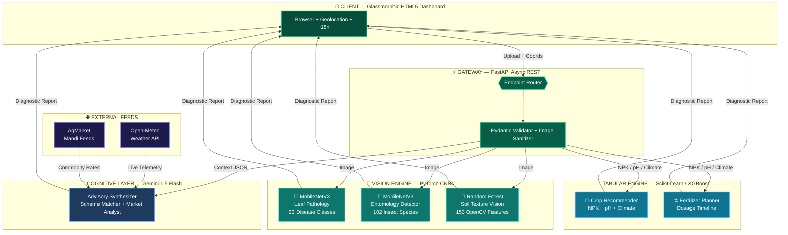

<!-- ═══════════════════════════════════════════════════════════════════ -->
<!--                         KRISHI AI · README                        -->
<!-- ═══════════════════════════════════════════════════════════════════ -->

<div align="center">

<a href="https://github.com/jeswanth90630/Krishi-ai">
  
</a>

<br/>

```
╔══════════════════════════════════════════════════════════════╗
║   🌱  Precision Agriculture Intelligence for Every Farmer    ║
║   Diagnose · Predict · Advise · Protect · Empower           ║
╚══════════════════════════════════════════════════════════════╝
```

<p>
  <a href="https://github.com/jeswanth90630/Krishi-ai"></a>
  <a href="https://python.org"></a>
  <a href="https://fastapi.tiangolo.com"></a>
  <a href="https://pytorch.org"></a>
  <a href="https://ai.google.dev"></a>
  <a href="https://opensource.org/licenses/MIT"></a>
</p>

<p>
  <b>
    <a href="#-the-problem-we-solve">Problem</a> ·
    <a href="#-system-architecture">Architecture</a> ·
    <a href="#-intelligence-pipeline">AI Pipeline</a> ·
    <a href="#-platform-modules">Modules</a> ·
    <a href="#-stack">Stack</a> ·
    <a href="#-getting-started">Get Started</a> ·
    <a href="#-api-reference">API</a>
  </b>
</p>

</div>

<br/>

---

## ⚡ At a Glance

<div align="center">

| &nbsp;&nbsp;&nbsp;&nbsp;🧬 Disease Vision&nbsp;&nbsp;&nbsp;&nbsp; | &nbsp;&nbsp;&nbsp;&nbsp;🐛 Pest Identification&nbsp;&nbsp;&nbsp;&nbsp; | &nbsp;&nbsp;&nbsp;&nbsp;🧪 Soil Intelligence&nbsp;&nbsp;&nbsp;&nbsp; | &nbsp;&nbsp;&nbsp;&nbsp;⚡ API Latency&nbsp;&nbsp;&nbsp;&nbsp; | &nbsp;&nbsp;&nbsp;&nbsp;🤖 Generative AI&nbsp;&nbsp;&nbsp;&nbsp; |
|:---:|:---:|:---:|:---:|:---:|
| **20+ Classes** | **102 Species** | **153 Features** | **< 150ms** | **Gemini 1.5** |
| MobileNetV3 CNN | Deep Entomology | OpenCV Vision | Async FastAPI | Contextual LLM |

</div>

<br/>

---

## 🌾 The Problem We Solve

> *Smallholder farmers across India lose up to* ***40% of annual crop yields*** *due to three invisible threats: undetected leaf disease, pest infestations they cannot identify, and soil chemistry they cannot test.*

**Krishi AI** is a multimodal agronomic intelligence platform that puts a full-stack diagnostic laboratory in every farmer's pocket — requiring nothing more than a smartphone camera. From a single image upload, the system returns:

- 🔬 A clinical-grade **plant disease diagnosis** with treatment protocol
- 🐛 An **entomological identification** with organic + chemical remedy options
- 🧪 A **soil composition profile** with NPK deficit calculations
- 💧 An **irrigation schedule** calibrated to real-time weather telemetry
- 📈 **Live Mandi commodity prices** with 7-day trend forecasting
- 📜 **Government scheme eligibility matching** (PM-KISAN, PMFBY, KUSUM)

---

## 🏛️ System Architecture

Krishi AI is built on an **asynchronous, event-driven microservice backbone**. Every image upload triggers a parallel inference pipeline — disease, pest, and soil models execute concurrently via FastAPI's async router, with Gemini LLM synthesizing a final advisory report.



<br/>

---

## 🧠 Intelligence Pipeline

Five specialized AI/ML engines form a **heterogeneous inference pipeline**, each purpose-built for a distinct sensory domain:

<br/>

```
 STAGE        ENGINE                  INPUT             COVERAGE         SAFETY GATE
 ─────────────────────────────────────────────────────────────────────────────────────
 1  VISION    MobileNetV3-Large       Leaf  224×224 px  20  diseases     conf < 35% → rescan
 2  VISION    MobileNetV3 Deep        Pest  224×224 px  102 species      conf < 20% → verify
 3  VISION    Random Forest + CV      Soil  256×256 px  153 features     conf < 40% → reject
 4  TABULAR   Random Forest + XGB     NPK, pH, Temp, RH  crop matrix    boundary checks
 5  COGNITIVE Gemini-1.5-Flash LLM   Structured JSON  Advisory output   schema + XSS guard
 ─────────────────────────────────────────────────────────────────────────────────────
```

<br/>

Each model is guarded by a **confidence threshold circuit-breaker** — if a model is uncertain, it halts and prompts a re-scan rather than issuing a wrong recommendation.

> [!IMPORTANT]
> **Feature Engineering for Soil Vision** — The 153 soil features are mathematically derived: **96 HSV histogram bins** + **48 LAB color moment statistics** + **6 RGB channel statistics** + **3 Sobel gradient magnitudes** (edge density proxies for soil texture coarseness).

<br/>

---

## 🚀 Platform Modules

<br/>

### 🔬 Module 1 · Multi-Modal Field Diagnostics

> *Point your camera. Get a clinical-grade field report in under 150ms.*

| Capability | What It Does |
|:---|:---|
| 🌱 **Instant Crop Pathology** | Detects fungal, bacterial, and viral infections (Blight, Rust, Scab, Mosaic) across 20 classes |
| 🐛 **Entomology Engine** | Pinpoints 102 insect species from a photo; maps to organic + chemical remedy protocols |
| 🧪 **Soil Vision Profiler** | Derives texture, porosity, and NPK suitability from raw soil images without lab equipment |
| 📊 **Severity Grading** | Scores infection severity from 0–100; triggers urgency flags for immediate intervention |

<br/>

### 🌾 Module 2 · Precision Crop & Water Advisory

> *Science-grade recommendations calibrated to your exact soil chemistry and local microclimate.*

| Capability | What It Does |
|:---|:---|
| ⚖️ **NPK Deficit Calculator** | Measures N / P / K shortfall (kg/acre); outputs a fertilizer dosage schedule |
| 💧 **Smart Irrigation Engine** | Computes daily evapotranspiration demand from Open-Meteo live weather telemetry |
| 📈 **Yield Maximizer** | Recommends top 3 high-value alternative cash crops ranked by soil-microclimate fit |
| 🔊 **Voice-Assisted Insights** | Converts advisory reports to regional-language audio via gTTS for zero-literacy access |

<br/>

### 📈 Module 3 · Mandi Market Intelligence

> *Know your market before you harvest. Sell at peak. Maximize margins.*

| Capability | What It Does |
|:---|:---|
| 📊 **Live Commodity Tracker** | Streams real-time price data from regional agricultural market (Mandi) feeds |
| 📉 **Trend Analytics** | Chart.js-powered 7-day price visualization with forecast curves |
| 🚚 **Arbitrage Analyzer** | Compares rural Mandi vs. city-centre rates to compute net transport profit margin |
| 📅 **Harvest Timing Guidance** | Predicts demand surge windows to advise optimal harvest date for premium pricing |

<br/>

### 📜 Module 4 · Welfare & Subsidy Matcher

> *Never miss a rupee of subsidy you are entitled to.*

| Capability | What It Does |
|:---|:---|
| 🎯 **Eligibility Engine** | Evaluates farm profile (landholding, crop type) against PM-KISAN, PMFBY, KUSUM schemes |
| 🔗 **Direct Portal Integration** | Deep-links to official central and state government application portals |
| 📚 **Knowledge Base** | Curated library of agronomical best practices, disaster recovery guides, and crop calendars |

<br/>

---

## 🛠️ Stack

<br/>

```
╔═══════════════════════════════════════════════════════════════════════╗
║                       TECHNOLOGY ARCHITECTURE                         ║
╠══════════════════╦════════════════════════════════════════════════════╣
║  BACKEND         ║  FastAPI 0.100+  ·  Uvicorn ASGI  ·  Pydantic v2  ║
╠══════════════════╬════════════════════════════════════════════════════╣
║  VISION AI       ║  PyTorch (MobileNetV3)  ·  OpenCV  ·  Pillow      ║
╠══════════════════╬════════════════════════════════════════════════════╣
║  TABULAR AI      ║  Scikit-Learn  ·  XGBoost  ·  NumPy / Pandas      ║
╠══════════════════╬════════════════════════════════════════════════════╣
║  GENERATIVE AI   ║  Google Gemini 1.5 Flash  ·  gTTS (TTS Engine)    ║
╠══════════════════╬════════════════════════════════════════════════════╣
║  FRONTEND        ║  HTML5  ·  CSS3 Glassmorphism  ·  ES6 JS          ║
║                  ║  Chart.js  ·  AOS.js  ·  SweetAlert2              ║
╠══════════════════╬════════════════════════════════════════════════════╣
║  EXTERNAL APIS   ║  Open-Meteo (Weather)  ·  AgMarket (Mandi Feeds)  ║
╚══════════════════╩════════════════════════════════════════════════════╝
```

<br/>

---

## 📂 Project Structure

```
Krishi-Ai-main/
│
├── backend/                         ← FastAPI Application Root
│   ├── app/
│   │   ├── routers/                 ← REST Endpoint Handlers
│   │   │   ├── detection.py         ·  /detect/disease · /detect/pest · /detect/soil
│   │   │   ├── prediction.py        ·  /predict/crop   · /predict/fertilizer
│   │   │   ├── advisory.py          ·  /advisory/generate
│   │   │   ├── market.py            ·  /market/prices
│   │   │   └── schemes.py           ·  /schemes/match
│   │   ├── services/                ← ML Inference Engines
│   │   │   ├── disease_service.py   ·  MobileNetV3 Leaf Pathology
│   │   │   ├── pest_service.py      ·  MobileNetV3 Entomology
│   │   │   ├── soil_service.py      ·  Random Forest Soil Vision
│   │   │   ├── crop_service.py      ·  XGBoost Crop Predictor
│   │   │   └── gemini_service.py    ·  Gemini LLM Advisory Generator
│   │   └── config.py                ·  Thresholds · Keys · Settings
│   ├── model_store/                 ← Trained Model Artifacts (.h5 / .pkl)
│   └── run.py                       ← Uvicorn Entry Point
│
├── frontend/                        ← Glassmorphic Web Client
│   ├── assets/                      ·  CSS Themes · i18n.js · kisaan.js
│   ├── components/                  ·  Navbar · Footer · Loader · Modals
│   ├── vendor/                      ·  Chart.js · AOS.js · SweetAlert2
│   ├── index.html                   ·  Landing Page
│   ├── detection.html               ·  Vision Scanner
│   ├── prediction.html              ·  NPK / Crop Calculator
│   ├── advisory.html                ·  AI Advisory Dashboard
│   ├── market.html                  ·  Mandi Price Analytics
│   └── schemes.html                 ·  Government Scheme Matcher
│
├── scripts/                         ← Dev Utilities (expand_pest_advisory.py)
├── requirements.txt                 ← Production Dependencies
└── README.md
```

<br/>

---

## 🚀 Getting Started

> [!NOTE]
> Prerequisites: **Python 3.9+** · **Git** · 4 GB RAM minimum for inference

<br/>

**① Clone & Enter**
```bash
git clone https://github.com/jeswanth90630/Krishi-Ai.git
cd Krishi-Ai-main
```

**② Create Isolated Environment**
```bash
python -m venv .venv

# Windows PowerShell
.\.venv\Scripts\activate

# macOS / Linux
source .venv/bin/activate
```

**③ Install Dependencies**
```bash
pip install -r requirements.txt

# Optional: CPU-only PyTorch (lighter footprint)
pip install torch torchvision --index-url https://download.pytorch.org/whl/cpu
```

**④ Launch the Server**
```bash
# Windows PowerShell
$env:PYTHONPATH="backend"; python backend/run.py

# macOS / Linux
PYTHONPATH=backend python backend/run.py
```

> [!TIP]
> Server starts at **`http://127.0.0.1:8000`**
> Interactive docs → **`http://127.0.0.1:8000/docs`** · Redoc → **`http://127.0.0.1:8000/redoc`**

<br/>

---

## 📡 API Reference

<br/>

**Detection Endpoints** — multipart image upload → AI diagnosis

| Method | Endpoint | Model | Returns |
|:---:|:---|:---:|:---|
| `POST` | `/api/v1/detect/disease` | MobileNetV3 | Pathology class · confidence · treatment steps |
| `POST` | `/api/v1/detect/pest` | MobileNetV3 | Species ID · organic & chemical remedies |
| `POST` | `/api/v1/detect/soil` | Random Forest | Soil texture · 153-feature profile · NPK suitability |

<br/>

**Prediction Endpoints** — JSON payload → agronomic recommendation

| Method | Endpoint | Input | Returns |
|:---:|:---|:---:|:---|
| `POST` | `/api/v1/predict/crop` | NPK · pH · Temp · Humidity | Top 3 crops · yield estimates |
| `POST` | `/api/v1/predict/fertilizer` | NPK deficit · crop type · area | kg/acre dosage · application calendar |

<br/>

**Intelligence Endpoints** — live data + LLM synthesis

| Method | Endpoint | Returns |
|:---:|:---|:---|
| `GET` | `/api/v1/market/prices` | Real-time Mandi rates · 7-day trend forecast |
| `POST` | `/api/v1/schemes/match` | Eligible welfare schemes · official application links |

<br/>

---

## 🛡️ Safety & Privacy

```
 GUARDRAIL                   MECHANISM                          THRESHOLD
 ────────────────────────────────────────────────────────────────────────
 Low Confidence Rejection    Confidence circuit-breaker         < 20-40%
 Ephemeral Image Processing  RAM-only inference, no disk write  Always
 AI Output Validation        Pydantic JSON schema enforcement   Always
 XSS Sanitization            Gemini output scrubbing            Always
 ────────────────────────────────────────────────────────────────────────
```

> [!WARNING]
> Krishi AI diagnostic outputs are **decision-support tools**, not a replacement for certified agronomic advice. Always cross-reference high-severity alerts with a licensed field agronomist before applying treatments.

<br/>

---

<div align="center">

```
═══════════════════════════════════════════════════════
  🌾  KRISHI AI  ·  Architecting Precision Agriculture
  Engineered with 💚 for Farming Ecosystems Worldwide
═══════════════════════════════════════════════════════
```

<a href="https://github.com/jeswanth90630/Krishi-ai">
  
</a>

</div>
